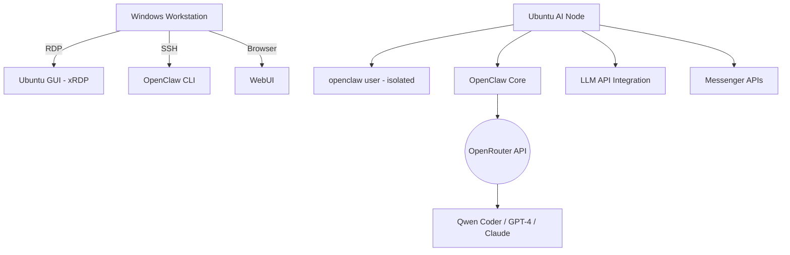

# OpenClaw AI Worker Node – Ubuntu + OpenClaw Intranet Deployment


````markdown
> **From Old Hardware to Smart AI Node:** A production-ready guide for deploying an isolated, remote-manageable AI agent server within your local network.

This project documents the setup of a dedicated **KI-Worker-Node** on repurposed hardware inside a private intranet. The goal is to provide a stable, isolated, and remotely controllable AI agent server that connects to external LLM APIs (e.g., OpenRouter) and can simulate multiple virtual "employees".

**Tech Stack:**

- Ubuntu 24.04 LTS Desktop
- OpenClaw Framework
- OpenSSH + xRDP for remote access
- OpenRouter (or alternative LLM provider)
- Optional: Docker-based deployment

---

## Table of Contents

1. [System Architecture](#-system-architecture)
2. [Base Installation – Ubuntu 24.04 LTS](#-base-installation--ubuntu-2404-lts)
3. [Network Setup](#-network-setup)
4. [Remote Access Setup](#-remote-access-setup)
5. [User & Permission Concept](#-user--permission-concept)
6. [OpenClaw Installation (Bare Metal)](#-openclaw-installation-bare-metal)
7. [WebUI & CLI Startup](#-webui--cli-startup)
8. [Security Hardening Guide (Production-Grade)](#-security-hardening-guide-production-grade)
9. [Docker-Based Alternative (Recommended for Isolation)](#-docker-based-alternative-recommended-for-isolation)
10. [LLM API Integration](#-llm-api-integration)
11. [Messenger Integration (Optional)](#-messenger-integration-optional)
12. [Operational Best Practices](#-operational-best-practices)
13. [Performance on Older Hardware](#-performance-on-older-hardware)
14. [Result](#-result)

---

## System Architecture


````

**Key Components:**
| Component | Purpose |
|-----------|---------|
| Ubuntu 24.04 LTS | Stable, long-term support OS |
| OpenClaw | AI agent framework for autonomous tasks |
| OpenRouter | Unified API access to multiple LLMs |
| xRDP / SSH | Secure remote management (GUI + CLI) |
| Docker (optional) | Process isolation & reproducible deployments |

---

## 🛠 Base Installation – Ubuntu 24.04 LTS

### 2.1 Download ISO

Get the official image:  
🔗 [https://ubuntu.com/download](https://ubuntu.com/download)

### 2.2 Create Bootable USB (Windows)

**Tool:** [Rufus](https://rufus.ie/)

- Partition scheme: **GPT** (UEFI)
- Image option: **ISO Mode**
- File system: FAT32

### 2.3 Installation Steps

- Select **"Normal Installation"**
- Enable **Full Disk Encryption** (recommended)
- Create admin user (e.g., `sysadmin`)
- After first boot:

```bash
sudo apt update && sudo apt upgrade -y
sudo reboot
```

---

## Network Setup

### 3.1 Static IP Configuration

**Recommended:** Configure DHCP reservation in your router  
**Example:** `192.168.0.50`

> This ensures your AI node is always reachable at the same address within the intranet.

---

## Remote Access Setup

### 4.1 SSH (Command Line Access)

```bash
sudo apt install openssh-server -y
sudo systemctl enable ssh
sudo ufw allow 22
```

**Client Options:**

- PuTTY (Windows)
- Windows PowerShell / Terminal
- VS Code with Remote-SSH Extension

### 4.2 RDP (Graphical Desktop Access)

```bash
sudo apt install xrdp -y
sudo systemctl enable xrdp
sudo ufw allow 3389
```

**Windows Client:** Use "Microsoft Remote Desktop" to connect to `192.168.0.50`

> Test connectivity from another machine in your intranet before proceeding.

---

## 👥 User & Permission Concept

### 5.1 Create Isolated Service User for OpenClaw

```bash
sudo adduser openclaw
```

**Critical Security Rules:**

- ❌ No `sudo` privileges
- ❌ Not member of `admin` or `sudo` groups
- ✅ Isolated home directory: `/home/openclaw`
- ✅ Optional: Apply AppArmor profile for additional confinement

---

## OpenClaw Installation (Bare Metal)

Switch to the service user:

```bash
su - openclaw
```

Clone and setup:

```bash
git clone <YOUR_REPO_URL>
cd openclaw
python3 -m venv venv
source venv/bin/activate
pip install -r requirements.txt
```

### Environment Configuration (`.env`)

Create a `.env` file in the project root:

```ini
# LLM Provider
LLM_PROVIDER=openrouter

# API Key (obtain from https://openrouter.ai)
LLM_API_KEY=sk-or-v1-xxxxxxxxxxxxxxxx

# Model Selection - Qwen Coder series recommended for coding tasks
# Examples: qwen-2.5-coder-32b-instruct, qwen-3.5-coder (if available)
MODEL=qwen-2.5-coder-32b-instruct

# Optional: Workspace path
WORKSPACE_PATH=/home/openclaw/openclaw/workspace
```

> 🔐 Never commit `.env` to version control. Add it to `.gitignore`.

---

## 🖥 WebUI & CLI Startup

### CLI Mode

```bash
python main.py
# Or with flags:
python main.py --mode autonomous --model qwen-2.5-coder-32b-instruct
```

### WebUI Mode (if available)

```bash
python webui.py
# Access via browser: http://192.168.0.50:8080
```

### Test Connection

```bash
python main.py --test-connection
```

---

## 🔒 Security Hardening Guide (Production-Grade)

### 8.1 SSH Hardening

Edit `/etc/ssh/sshd_config`:

```config
PermitRootLogin no
PasswordAuthentication no
PubkeyAuthentication yes
AllowUsers sysadmin openclaw
X11Forwarding no
MaxAuthTries 3
```

Apply changes:

```bash
sudo systemctl restart ssh
```

### 8.2 Firewall Policy (UFW)

```bash
sudo ufw default deny incoming
sudo ufw default allow outgoing
sudo ufw allow 22      # SSH
sudo ufw allow 3389    # RDP
# Optional: Restrict to specific subnet
# sudo ufw allow from 192.168.0.0/24 to any port 22
sudo ufw enable
```

### 8.3 Fail2Ban (Brute-Force Protection)

```bash
sudo apt install fail2ban -y
sudo systemctl enable fail2ban
```

### 8.4 Automatic Security Updates

```bash
sudo apt install unattended-upgrades -y
sudo dpkg-reconfigure unattended-upgrades
```

### 8.5 Process Isolation (systemd Service)

Create `/etc/systemd/system/openclaw.service`:

```ini
[Unit]
Description=OpenClaw AI Worker
After=network.target

[Service]
Type=simple
User=openclaw
WorkingDirectory=/home/openclaw/openclaw
Environment=PATH=/home/openclaw/openclaw/venv/bin
ExecStart=/home/openclaw/openclaw/venv/bin/python main.py
Restart=on-failure
NoNewPrivileges=true
PrivateTmp=true
MemoryLimit=2G

[Install]
WantedBy=multi-user.target
```

Enable service:

```bash
sudo systemctl daemon-reload
sudo systemctl enable openclaw
sudo systemctl start openclaw
```

### 8.6 AppArmor (Optional Advanced Hardening)

Check status:

```bash
sudo aa-status
```

Create a custom profile if needed for additional syscall restrictions.

---

## Docker-Based Alternative (Recommended for Isolation)

### 9.1 Install Docker

```bash
sudo apt install docker.io -y
sudo systemctl enable docker
sudo usermod -aG docker openclaw
# Log out and back in for group changes to apply
```

### 9.2 Example Dockerfile

```dockerfile
FROM python:3.11-slim

WORKDIR /app
COPY requirements.txt .
RUN pip install --no-cache-dir -r requirements.txt

COPY . .
ENV LLM_PROVIDER=openrouter
ENV MODEL=qwen-2.5-coder-32b-instruct

USER openclaw
CMD ["python", "main.py"]
```

### 9.3 Build & Run

```bash
docker build -t openclaw-node .

docker run -d \
  -p 8080:8080 \
  --env-file .env \
  --name openclaw \
  --restart unless-stopped \
  --memory 2g \
  --cpus 2 \
  openclaw-node
```

### 9.4 Docker Compose (Optional)

`docker-compose.yml`:

```yaml
version: "3.8"
services:
  openclaw:
    build: .
    container_name: openclaw
    env_file: .env
    ports:
      - "8080:8080"
    restart: unless-stopped
    mem_limit: 2g
    cpus: 2
    volumes:
      - ./workspace:/app/workspace
```

Start with: `docker-compose up -d`

### Docker Advantages

| Benefit           | Description                                |
| ----------------- | ------------------------------------------ |
| Process Isolation | Container sandboxing limits attack surface |
| Port Management   | Clean, explicit port mapping               |
| Reproducibility   | Same image runs everywhere                 |
| Easy Updates      | `docker pull` + restart = updated node     |
| Resource Limits   | CPU/Memory constraints prevent overload    |

---

## 🤖 LLM API Integration

### Recommended Providers

| Provider       | Endpoint                       | Use Case                           |
| -------------- | ------------------------------ | ---------------------------------- |
| **OpenRouter** | `https://openrouter.ai/api/v1` | Multi-model access, cost-efficient |
| OpenAI         | `https://api.openai.com/v1`    | GPT-4 series, reliable             |
| Anthropic      | `https://api.anthropic.com`    | Claude models, strong reasoning    |

### Why OpenRouter?

- Single API key for 100+ models
- Automatic fallback if a model is unavailable
- Transparent pricing & usage dashboard
- Supports Qwen, Llama, Mistral, GPT, Claude & more

### Model Recommendation for Coding Tasks

```ini
# Best for code generation & review
MODEL=qwen-2.5-coder-32b-instruct

# Alternative: balanced performance/cost
MODEL=mistralai/mistral-large-2411

# For complex reasoning + code
MODEL=anthropic/claude-3.5-sonnet
```

> Check [OpenRouter Models](https://openrouter.ai/models) for the latest model IDs and pricing.

---

## Messenger Integration (Optional)

Connect your AI agent to communication platforms:

### Telegram Bot

```ini
TELEGRAM_BOT_TOKEN=your_token_here
TELEGRAM_CHAT_ID=123456789
```

### WhatsApp Business API

```ini
WHATSAPP_API_KEY=your_key
WHATSAPP_PHONE_ID=your_phone_id
```

> 🔐 Store all tokens exclusively in `.env` – never in code or logs.

---

## 🛠 Operational Best Practices

✅ **Do:**

- Run OpenClaw as non-root user (`openclaw`)
- Use environment variables for secrets
- Rotate API keys periodically
- Monitor logs: `tail -f logs/openclaw.log`
- Define separate agent profiles for different tasks
- Implement a backup strategy for `/workspace` and `.env`

❌ **Avoid:**

- Running services as `root`
- Hardcoding credentials
- Exposing ports to the public internet without a reverse proxy + auth
- Ignoring resource usage on older hardware

### Monitoring Tools

```bash
# Real-time resource usage
htop
glances

# Log monitoring
journalctl -u openclaw -f
```

---

## Performance on Older Hardware

Optimize for limited resources:

| Optimization            | Command / Action                                                                                               |
| ----------------------- | -------------------------------------------------------------------------------------------------------------- |
| Lightweight Desktop     | Install Xfce: `sudo apt install xubuntu-desktop`                                                               |
| Reduce Swappiness       | `sudo sysctl vm.swappiness=10` (add to `/etc/sysctl.conf`)                                                     |
| Disable Unused Services | `sudo systemctl disable bluetooth cups`                                                                        |
| Docker Limits           | Use `--memory` and `--cpus` flags                                                                              |
| Swap File (if needed)   | `sudo fallocate -l 2G /swapfile && sudo chmod 600 /swapfile && sudo mkswap /swapfile && sudo swapon /swapfile` |

---

## Result

Your repurposed PC is now transformed into:

✅ **Intranet AI Worker Node** – Always-on, locally accessible  
✅ **Multi-Agent System** – Simulate specialized virtual employees  
✅ **API-Powered AI Assistant** – Leverages cutting-edge LLMs via OpenRouter  
✅ **Remote-Administered Server** – Managed via SSH/RDP from any workstation  
✅ **Secure, Isolated Environment** – Hardened OS + user permissions + firewall

---

## License & Disclaimer

- This deployment guide is intended for **private intranet use**.
- External API usage (OpenRouter, etc.) incurs token-based costs – monitor usage.
- Model availability and names may change – verify against provider documentation.
- Always test autonomous actions in **Safe Mode** before enabling full auto-execution.

---

> 🔄 **Last Updated**: March 2026  
> 🛠 **Maintained by**: Besem Maazi  
> 💡 **For**: Internal use & sharing with trusted collaborators

_Transform old hardware into intelligent infrastructure – securely, efficiently, autonomously._

```

```
