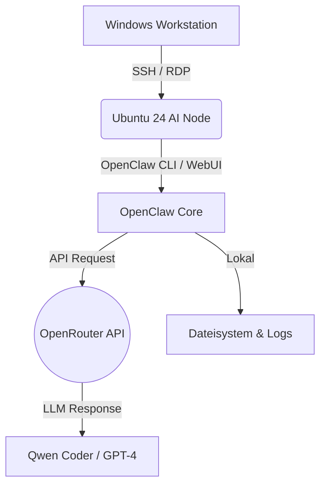

# AI Worker Node – Ubuntu + OpenClaw Intranet Deployment

````markdown
> **Aus Alt mach Neu:** Verwandelt einen älteren PC in einen autonomen KI-Worker-Node innerhalb eines sicheren Intranets.

Dieses Dokument beschreibt den kompletten Setup-Prozess für einen **OpenClaw AI Server** auf Ubuntu 24.04 LTS. Der Fokus liegt auf der autonomen Funktion von OpenClaw, gekoppelt mit der **OpenRouter API** (z. B. Qwen Coder Modelle), um intelligente Agenten-Aufgaben im lokalen Netzwerk zu erledigen.

---

## Hinweise!

- Dieses Setup ist für **Intranet-Nutzung** konzipiert.
- Bei Nutzung externer APIs (OpenRouter) fallen Kosten pro Token an.
- Modellnamen können sich ändern (OpenRouter Dokumentation prüfen).

---

## Inhaltsverzeichnis

1. [Architektur & Ziel](#-architektur--ziel)
2. [Voraussetzungen](#-voraussetzungen)
3. [Deployment Flow](#-deployment-flow)
4. [OpenClaw Onboarding & Konfiguration](#-openclaw-onboarding--konfiguration)
5. [Autonome Agenten einrichten](#-autonome-agenten-einrichten)
6. [Security Hardening](#-security-hardening)
7. [Wartung & Monitoring](#-wartung--monitoring)

---

## Architektur & Ziel

Das System läuft isoliert im Intranet. Externe KI-Intelligenz wird via API hinzugebucht, Daten verbleiben lokal.


````

**Hauptmerkmale:**

- **Hardware:** Repurposed Old-PC (Energieeffizient).
- **OS:** Ubuntu 24.04 LTS (GUI für lokalen Zugriff, Headless möglich).
- **Zugriff:** SSH (CLI) & xRDP (GUI) im Intranet.
- **KI:** OpenClaw Framework + OpenRouter (Modell-Auswahl flexibel).

---

## 🛠 Voraussetzungen

- [ ] Alter PC (mind. 8GB RAM empfohlen, SSD bevorzugt).
- [ ] Ubuntu 24.04 LTS ISO.
- [ ] Netzwerkzugang (Intranet).
- [ ] OpenRouter API Key ([openrouter.ai](https://openrouter.ai/)).
- [ ] Grundlegende Linux-Kenntnisse.

---

## Deployment Flow

Der Weg vom blanken Hardware-Zustand zum laufenden AI-Agenten.

### 1. Ubuntu 24.04 Installation

- **ISO:** [ubuntu.com/download](https://ubuntu.com/download)
- **Setup:** Normal Installation, Full Disk Encryption (empfohlen).
- **User:** Admin-User erstellen (z. B. `sysadmin`).
- **Update:**
  ```bash
  sudo apt update && sudo apt upgrade -y
  sudo reboot
  ```

### 2. Netzwerk & Remote Access

Damit alle PCs im Intranet kommunizieren können:

- **Feste IP:** Im Router per DHCP-Reservierung setzen (z. B. `192.168.0.50`).
- **SSH (CLI):**
  ```bash
  sudo apt install openssh-server -y
  sudo systemctl enable ssh
  ```
- **xRDP (GUI):**
  ```bash
  sudo apt install xrdp -y
  sudo systemctl enable xrdp
  ```
- **Firewall:**
  ```bash
  sudo ufw allow 22
  sudo ufw allow 3389
  sudo ufw enable
  ```

> **Test:** Von einem Windows-PC im selben Netzwerk via `ssh user@192.168.0.50` oder Remote Desktop verbinden.

### 3. OpenClaw Installation (Bare Metal)

Erstellung eines isolierten Service-Users für maximale Sicherheit.

```bash
# User erstellen (kein sudo!)
sudo adduser openclaw

# Wechseln zum User
su - openclaw

# Repository klonen
git clone <DEIN_OPENCLAW_REPO_URL>
cd openclaw

# Virtuelle Umgebung erstellen
python3 -m venv venv
source venv/bin/activate

# Abhängigkeiten installieren
pip install -r requirements.txt
```

---

## OpenClaw Onboarding & Konfiguration

Dies ist der wichtigste Schritt für die KI-Funktionalität.

### 1. Environment Variables (.env)

Erstelle im Projektverzeichnis eine `.env` Datei. Hier werden die Zugangsdaten sicher gespeichert.

```bash
nano .env
```

**Inhalt:**

```ini
# Provider Auswahl
LLM_PROVIDER=openrouter

# API Key (Von openrouter.ai)
LLM_API_KEY=sk-or-v1-xxxxxxxxxxxxxxxx

# Modellwahl (Beispiel: Qwen Coder Linie)
# Empfohlen für Coding-Tasks: qwen-2.5-coder-32b-instruct
MODEL=qwen-2.5-coder-32b-instruct

# Optional: Projekt Pfad
WORKSPACE_PATH=/home/openclaw/openclaw/workspace
```

### 2. Erster Start

Teste die Verbindung zur API und die lokale Umgebung.

```bash
# CLI Modus
python main.py --test-connection

# WebUI Modus (falls vorhanden)
python webui.py
```

---

## OpenClaw Autonome Agenten einrichten

OpenClaw kann als autonomer Worker agieren. Hier wird definiert, _was_ die KI tun soll.

### 1. Agenten-Profil erstellen

Definiere die Rolle des Agenten in der Konfiguration (z. B. `agents.yaml` oder via CLI).

**Beispielrolle: "Code Reviewer"**

- **Ziel:** Prüft hochgeladene Skripte auf Sicherheit.
- **Modell:** Qwen Coder (hohe Präzision bei Code).
- **Trigger:** Dateiänderung im Workspace oder Zeitplan.

### 2. Autonomie-Level festlegen

Entscheide, ob der Agent nur vorschlägt oder direkt ausführt.

- **Safe Mode:** Agent gibt Empfehlungen aus (Human-in-the-Loop).
- **Auto Mode:** Agent führt Tasks selbstständig aus (Nur für vertrauenswürdige Tasks).

> **Hinweis:** Für den Start wird **Safe Mode** empfohlen. Prüfe die Logs, bevor du volle Autonomie gewährst.

---

## Security Hardening

Da der Server im Intranet läuft, ist Sicherheit dennoch Priorität.

1. **SSH Absichern:**
   Bearbeite `/etc/ssh/sshd_config`:

   ```config
   PermitRootLogin no
   PasswordAuthentication no
   PubkeyAuthentication yes
   AllowUsers sysadmin openclaw
   ```

   _Neustart:_ `sudo systemctl restart ssh`

2. **Fail2Ban:**
   Schutz gegen Brute-Force Angriffe.

   ```bash
   sudo apt install fail2ban -y
   ```

3. **Rechte:**
   Der `openclaw` User darf **kein sudo** haben. API Keys sind nur in der `.env` (nicht im Git Repo!).

4. **Updates:**
   Automatisiere Sicherheitsupdates:
   ```bash
   sudo apt install unattended-upgrades
   ```

---

## Wartung & Monitoring

- **Logs prüfen:** `tail -f logs/openclaw.log`
- **Ressourcen:** Nutze `htop` oder `glances`, um CPU/RAM im Auge zu behalten.
- **Backup:** Sichere regelmäßig den `workspace` Ordner und die `.env` Datei (extern speichern!).
- **Docker Alternative:** Für noch bessere Isolation kann OpenClaw auch per Docker laufen (siehe `Dockerfile` im Repo).

---

```

```
